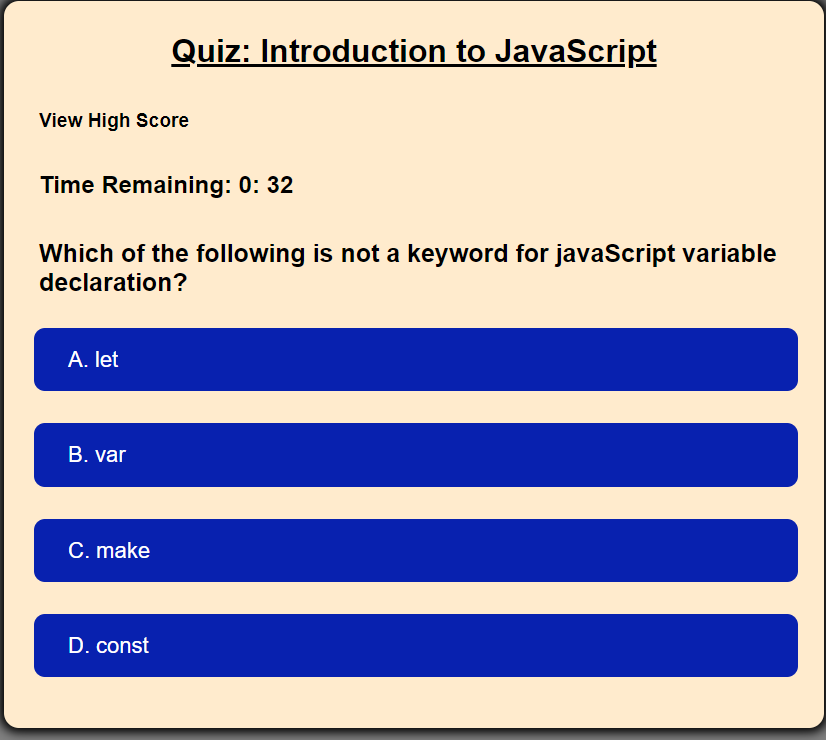
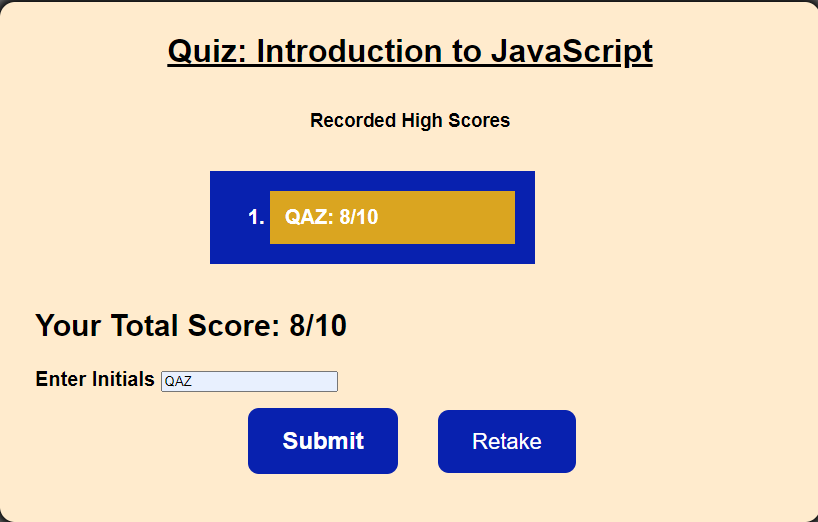

# Note Taker

## Table of contents

- [Overview](#overview)
  - [The challenge](#the-challenge)
  - [User Story](#user-story)
  - [Acceptance Criteria](#acceptance-criteria)
  - [Screenshot](#screenshot)
  - [Links](#links)
- [My process](#my-process)
  - [Built with](#built-with)
  - [What I learned](#what-i-learned)
- [Author](#author)


## Overview

### The challenge

The challenge is to build a timed coding quiz with multiple-choice questions. This app runs in the browser, and features dynamically updated HTML and CSS powered by JavaScript code. It has a clean, polished, and responsive user interface. 

### User Story

AS A coding boot camp student
I WANT to take a timed quiz on JavaScript fundamentals that stores high scores
SO THAT I can gauge my progress compared to my peers

### Acceptance Criteria

GIVEN I am taking a code quiz
WHEN I click the start button
THEN a timer starts and I am presented with a question
WHEN I answer a question
THEN I am presented with another question
WHEN I answer a question incorrectly
THEN time is subtracted from the clock
WHEN all questions are answered or the timer reaches 0
THEN the game is over
WHEN the game is over
THEN I can save my initials and score

### Screenshot






### Links

- Solution URL: [Github Repo](https://github.com/Monkonjay/Timed-Exam)
- Live Site: [Test the Project](https://monkonjay.github.io/Timed-Exam/)


## My process

### Built with

- Javascript
- HTML
- CSS


### What I learned

In this project, I manipulated the DOM, worked with arrays and functions and time interval. 


```javaScript 
if (timeLeft <= 0) {
            clearInterval(timeInterval);
            timerEl.textContent = " ";
            showResults();
        }
```

## Author

- Website - [Robert M Greene]( https://monkonjay.github.io/Portfolio/)
- Github - [Monkonjay](https://github.com/Monkonjay)